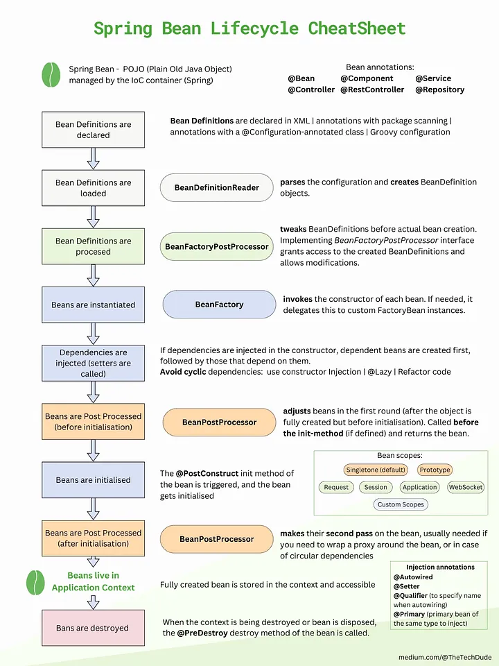

# 1 Bean

Beanという概念はSpringFrameworkの一つの基礎となる。全てのBeanはSpringコンテイナより管理することで、各イベントで拡張ポイントを提供できています。クラスのインスタンス化したもの、つまり` new class() `で生成したObjectと同じものであり、Objectの生成や管理はSpringより実施する。

## 1.1 ライフサイクル

Beanの生成から消滅までのライフサイクルです。



## 1.2 Bean定義方法

- `@ComponentScan`+`@Componenet`などクラスにアノテーションをつける
- `@Configuration`+`@Bean`
- XMLにBean定義する

## 1.3 スコープ

定義されているBeanは利用可能なスコープを指定することが可能、よく利用しているのは：

- singleton：singletonはSpring Frameworkのデフォルトの設定であり、DIコンテナ起動時にインスタンスを生成し、共有して利用するスコープ
- prototype：Bean取得時に毎回インスタンスを生成するスコープです。スレッドセーフではない場合利用
- session：HTTPセッション単位でBeanインスタンスを生成するスコープ
- request：HTTPリクエスト単位でBeanインスタンスを生成するスコープ
- カスタムスコープ：独自に定義したルールでBeanのインスタンスを生成するスコープ

## 1.4 Beanの利用

BeanはSpringより生成して管理しているので、利用するときにも便利である。

- `@Autowired`をを利用して

  ```java
  public class HogeController{
  
  @Autowired
  private HugaService hugaService;
  
  ...
  }
  ```

- ApplicationContextから取得

  ```java
  Bean1 bean1 = ApplicationContext.getBean(Bean1.class);
  Object bean1 = ApplicationContext.getBean("bean1");
  ```

- コンストラクタ

  Bean定義メソッドやクラスコンストラクタ定義での引数はSpringより自動注入してくれる

  ```java
  @Configuration
  public class MyBatisConfig {
  
      @Bean
      public SqlSessionFactory sqlSessionFactory(DataSource dataSource , MybatisProperties properties ) throws Exception {
  		・・・
      }
  }
  ```

## 1.5 Beanのそのほか

- 複数同じ型のBean登録する場合、型で`AutoWired`するとNGとなる。`@Primary`をつけるかBean名前を指定して`AutoWired`する

# 2 AOP(Aspect Oriented Programming)

## 2.1. 用語

### 2.1.1. Advice

AOPで実行する処理内容(横断的関心事)。ログの出力やトランザクションの制御など共通な処理

### 2.1.2. Pointcut

処理を実行する対象(クラス、メソッド)

### 2.1.3. JoinPoint

処理を実行するタイミング

- 種類

    | 実行タイミング |                     内容                     |
    | :------------: | :------------------------------------------: |
    |     Before     |    対象のメソッドが実行される前に処理する    |
    | After(finally) |    対象のメソッドが実行された後に処理する    |
    | AfterReturning | 対象のメソッドが正常処理した場合のみ処理する |
    |     Around     |      対象のメソッド実行の前後に処理する      |
    | AfterThrowing  | 対象のメソッドが異常終了した場合のみ処理する |

### 2.1.4 AOPプロキシ

Spring Frameworkでは、AOPプロキシはJDKダイナミックプロキシまたはCGLIBプロキシです。

**JDK Dynamic Proxy と CGLIB Proxy の違い**

| 項目                         | JDK Dynamic Proxy                  | CGLIB Proxy                      |
| ---------------------------- | ---------------------------------- | -------------------------------- |
| **インターフェースの必要性** | 必須 (インターフェースを実装)      | 不要 (クラス自体を拡張)          |
| **動作の仕組み**             | リフレクションを使用               | バイトコードの生成               |
| **適用範囲**                 | インターフェースに基づくクラスのみ | クラス全体、インターフェース不要 |
| **final クラス/メソッド**    | サポート                           | サポートしない                   |
| **パフォーマンス**           | 高速                               | やや低下することがある           |


# 3 MVC


ServletFilter      

# 4 SpringBoot


SpringBoot　　　　　依存関係

  